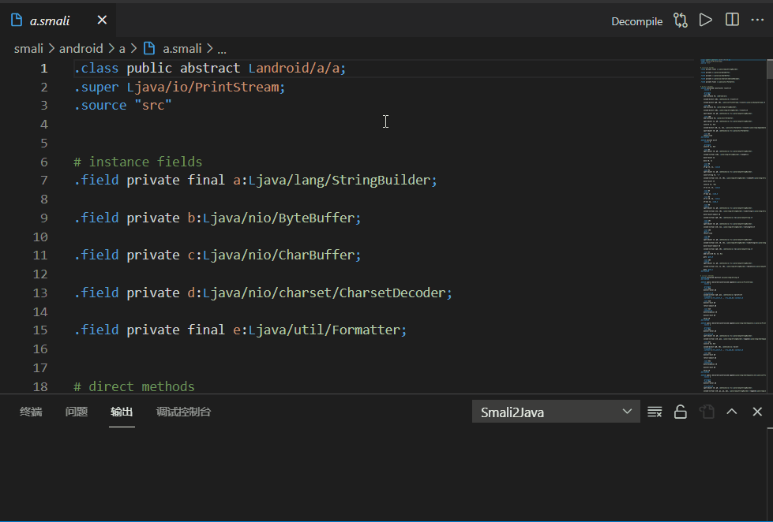

# Smali2Java

smali2java是一个vscode插件，允许你随时将一个`smali`文件反编译为java代码，这在测试`smali`修改效果时很有帮助。

## 插件安装
https://marketplace.visualstudio.com/items?itemName=ooooonly.smali2java

## 使用方法

1. 将 `smali2java.jadxPath`配置项设置为`jadx`可执行文件路径。

> [jadx](https://github.com/skylot/jadx) 是一个优秀的反编译工具。 Smali2Java 使用它完成反编译工作。后续将会支持调用更多反编译工具。

下载 [jadx](https://github.com/skylot/jadx), 解压至某处, 修改配置项 `smali2java.jadxPath` 为你的jadx可执行文件路径 (不是 jadx-gui)。
- 比如: C:/Program Files/jadx/bin/jadx.bat

2. 使用vscode打开smali文件。在右键菜单中选择 `Decompile to Java` 。或者直接点击标题栏上的 `Decompile` 按钮.

## 插件设置

* `smali2java.jadxPath`: 设置jadx可执行文件路径
* `smali2java.jadxOptions`: 设置jadx命令行额外参数
